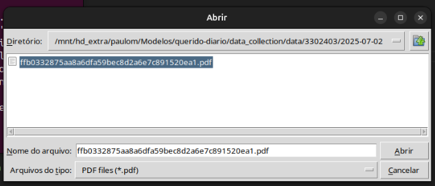

**English (US)** | [Português (BR)](/docs/README.md)

<p align="center">
  <a href="https://queridodiario.ok.org.br/sobre" target="_blank"> 
 <a href="https://www.tcerj.tc.br/portalnovo/" target="_blank"> 
  </a>
</p>

This project presents a proof of concept developed during an internship at the State Court of Accounts of Rio de Janeiro (TCE‑RJ).

The overall goal of this project is to create a functional graphical interface that integrates spiders from the Querido Diário project with a local text‑summarization system. The specific objectives are: (1) to enable execution of Scrapy scrapers via an intuitive interface; (2) to extract textual content from the generated PDFs; and (3) to apply a local AI to automatically summarize the documents.

# Summary
- [Development Environment](#development-environment)
- [How to run](#how-to-run)
- [Thanks](#thanks)
- [Open Knowledge Brazil](#open-knowledge-brazil)
- [License](#license)


# Development Environment
You need to have [Python](https://docs.python.org/3/) (+3.0) and [Scrapy](https://scrapy.org) framework installed.

The commands below set it up in Linux operating system. They consist of creating a [virtual Python environment](https://docs.python.org/3/library/venv.html), installing the requirements listed in `requirements-dev` and the code standardization tool `pre-commit`.

``` console
python3 -m venv .venv
source .venv/bin/activate
pip install -r data_collection/requirements-dev.txt
pre-commit install
```
1. Install llama-cpp-python:
``` console
pip install llama-cpp-python
```
If you want the execution to be faster with optimized CPU support:
```console
CMAKE_ARGS="-DLLAMA_BLAS=ON -DLLAMA_BLAS_VENDOR=OpenBLAS" pip install llama-cpp-python --force-reinstall --no-cache-dir
```
2. Chose and dowload a model .gguf
Sugestão leve e eficiente: [Mistral 7B Instruct GGUF (Q4_K_M)]
```console
mkdir -p ~/modelos-llm && cd ~/modelos-llm
wget https://huggingface.co/TheBloke/Mistral-7B-Instruct-v0.1-GGUF/resolve/main/mistral-7b-instruct-v0.1.Q4_K_M.gguf -O mistral.gguf
```
SET THE PATH TO THE MODEL IN THE VARIABLE MODEL_PATH IN THE FILE interface_resumo.py

# How to run
To try running a scraper already integrated into the project or to test what you are developing, follow the commands:

1. If you haven't already done so, activate the virtual environment in the `/querido-diario` directory:
``` console
source .venv/bin/activate
```
2. Go to the `data_collection` directory:
```console
cd data_collection
```
3. Check the available scrapers list:
```console
scrapy list
```
4. Run:
```console
python interface_scrapy.py
```
5. The scraped diaries will be saved in the directory `data_collection/data`
    

6. Run the summary with AI:
```console
python interface_resumo.py 
```



# Thanks
This project is maintained by Open Knowledge Brazil and made possible thanks to the technical communities, the [Ambassadors of Civic Innovation](https://embaixadoras.ok.org.br/), volunteers and financial donors, in addition to partner universities, companies supporters and funders.

Meet [who supports Querido Diario](https://queridodiario.ok.org.br/apoie#quem-apoia).

# Open Knowledge Brazil
<p>
  <a href="https://bsky.app/profile/ok.org.br" target="_blank">
    
  </a>
  <a href="https://www.instagram.com/openknowledgebrasil/" target="_blank">
    
  </a>
  <a href="https://www.linkedin.com/company/open-knowledge-brasil" target="_blank">
    
  </a> 
  <a href="https://mastodon.social/@okbr" target="_blank">
    
  </a>
</p>

[Open Knowledge Brazil](https://ok.org.br/) is a non-profit civil society organization whose mission is to use and develop civic tools, projects, public policy analysis and data journalism to promote free knowledge in the various fields of society.

All work produced by OKBR is openly and freely available.

# License

Code licensed under the [MIT License](/LICENSE.md).
