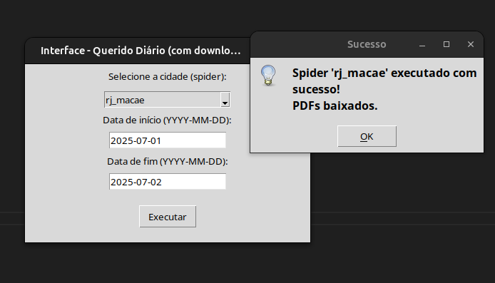
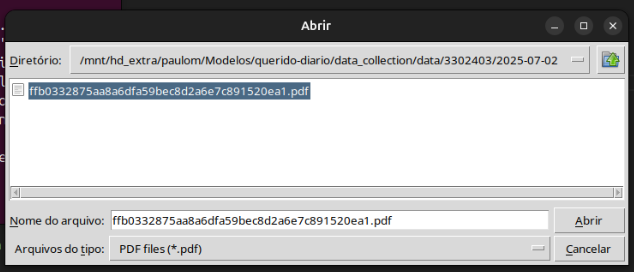
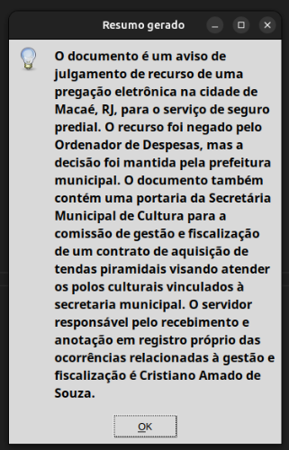

**Português (BR)** | [English (US)](/docs/README-en-US.md)

<p align="center">
  <a href="https://queridodiario.ok.org.br/sobre" target="_blank"> 
 <a href="https://www.tcerj.tc.br/portalnovo/" target="_blank"> 
  </a>
</p>

# TCE-RJ & Querido Diário

Este Projeto apresenta uma prova de conceito desenvolvida durante estágio no Tribunal de Contas do Estado do Rio de Janeiro (TCE-RJ).

O objetivo geral deste projeto é criar uma interface gráfica funcional que integre spiders do projeto Querido Diário com um sistema local de resumo textual. Como objetivos específicos, destacam-se: (1) permitir a execução de raspadores Scrapy por meio de interface intuitiva; (2) extrair o conteúdo textual de PDFs gerados; e (3) aplicar uma IA local para resumir automaticamente os documentos.  

# Sumário
- [Ambiente de desenvolvimento](#ambiente-de-desenvolvimento)
- [Template para raspadores](#template-para-raspadores)
- [Como executar](#como-executar)
- [Agradecimentos](#agradecimentos)
- [Open Knowledge Brasil](#open-knowledge-brasil)
- [Licença](#licença)

# Ambiente de desenvolvimento
Você precisa ter [Python](https://docs.python.org/3/) (+3.0) e o framework [Scrapy](https://scrapy.org) instalados. 

Os comandos abaixo preparam o ambiente em sistema operacional Linux. Eles consistem em criar um [ambiente virtual de Python](https://docs.python.org/pt-br/3/library/venv.html), instalar os requisitos listados em `requirements-dev` e a ferramenta para padronização de código `pre-commit`.

``` console
python3 -m venv .venv
source .venv/bin/activate
pip install -r data_collection/requirements-dev.txt
pre-commit install
```
1. Instalar llama-cpp-python:
``` console
pip install llama-cpp-python
```
Se quiser que a execução seja mais rápida com suporte a CPU otimizada:
```console
CMAKE_ARGS="-DLLAMA_BLAS=ON -DLLAMA_BLAS_VENDOR=OpenBLAS" pip install llama-cpp-python --force-reinstall --no-cache-dir
```
2. Escolher e baixar um modelo .gguf
Sugestão leve e eficiente: [Mistral 7B Instruct GGUF (Q4_K_M)]
```console
mkdir -p ~/modelos-llm && cd ~/modelos-llm
wget https://huggingface.co/TheBloke/Mistral-7B-Instruct-v0.1-GGUF/resolve/main/mistral-7b-instruct-v0.1.Q4_K_M.gguf -O mistral.gguf
```
AJUSTE O CAMINHO PRO MODELO NA VARIÁVEL MODEL_PATH NO ARQUIVO interface_resumo.py

# Template para raspadores

Ao invés de começar um arquivo de raspador do zero, você pode inicializar um arquivo de código de raspador já no padrão do Querido Diário, a partir de um template. Para isso, faça: 

1. Vá para o diretório `data_collection`:
```console
cd data_collection
```
2. Acione o template:
```console
scrapy genspider -t qdtemplate <uf_nome_do_municipio> <https://sitedomunicipio...>
```

Um arquivo `uf_nome_do_municipio.py` será criado no diretório `spiders`, com alguns campos já preenchidos. O diretório é organizado por UF, lembre-se de mover o arquivo para o diretório adequado.

# Como executar
Para experimentar a execução de um raspador já integrado ao projeto ou testar o que esteja desenvolvendo, siga os comandos: 

1. Se ainda não o fez, ative o ambiente virtual no diretório `/querido-diario`:
``` console
source .venv/bin/activate
```
2. Vá para o diretório `data_collection`:
```console
cd data_collection
```
3. Verifique a lista de raspadores disponíveis:
```console
scrapy list
```
4. Execute:
```console
python interface_scrapy.py
```
5. Os diários coletados na raspagem serão salvos no diretório `data_collection/data`
    

6. Execute o resumo com AI:
```console
python interface_resumo.py 
```



# Agradecimentos
O Querido Diário é mantido pela Open Knowledge Brasil e possível graças às comunidades técnicas, às [Embaixadoras de Inovação Cívica](https://embaixadoras.ok.org.br/), às pessoas voluntárias e doadoras financeiras, além de universidades parceiras, empresas apoiadoras e financiadoras.

Conheça [quem apoia o Querido Diário](https://queridodiario.ok.org.br/apoie#quem-apoia).

# Open Knowledge Brasil
<p>
  <a href="https://bsky.app/profile/ok.org.br" target="_blank">
    
  </a>
  <a href="https://www.instagram.com/openknowledgebrasil/" target="_blank">
    
  </a>
  <a href="https://www.linkedin.com/company/open-knowledge-brasil" target="_blank">
    
  </a> 
  <a href="https://mastodon.social/@okbr" target="_blank">
    
  </a>
</p>

A [Open Knowledge Brasil](https://ok.org.br/) é uma organização da sociedade civil sem fins lucrativos, cuja missão é utilizar e desenvolver ferramentas cívicas, projetos, análises de políticas públicas, jornalismo de dados para promover o conhecimento livre nos diversos campos da sociedade. 

Todo o trabalho produzido pela OKBR está disponível livremente.

# Licença

Código licenciado sob a [Licença MIT](LICENSE.md).
